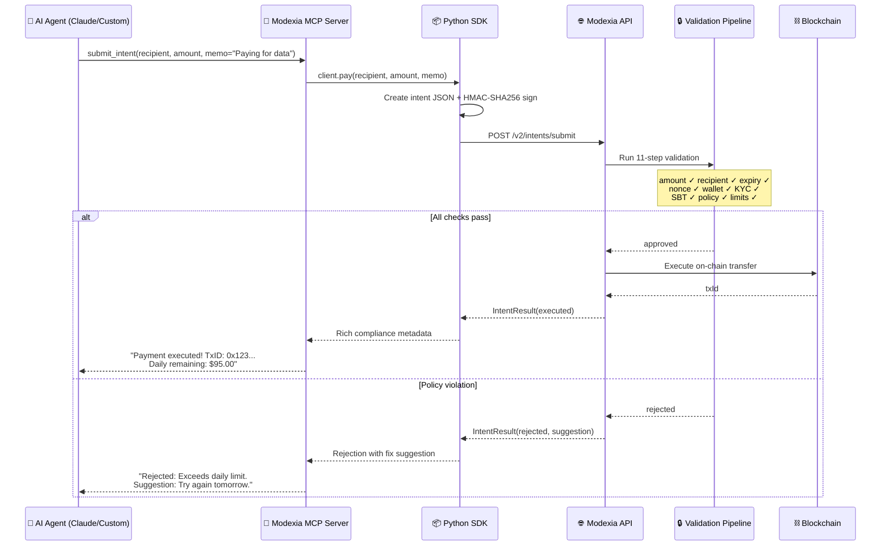
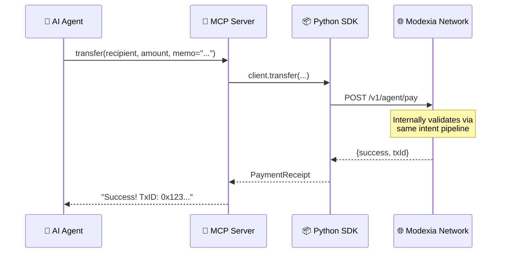
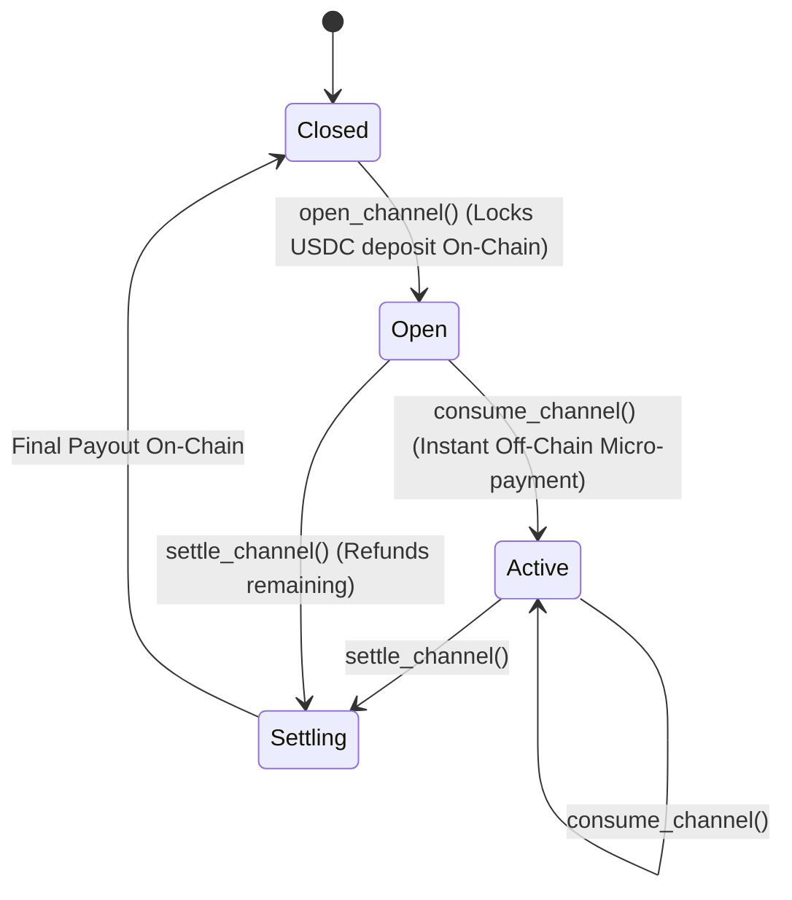

<div align="center">
  <h1>🏦 Modexia AgentPay MCP Server</h1>
  <p><b>The official Model Context Protocol (MCP) server for autonomous AI Agents to interact with Modexia's crypto infrastructure.</b></p>
  
  [](https://badge.fury.io/py/modexia-mcp)
  [](https://pypi.org/project/modexia-mcp/)
  [](https://opensource.org/licenses/MIT)
</div>

<br />

Welcome to the **Modexia MCP Server** (`modexia-mcp`). This server allows your AI agents (like Claude, LangChain bots, or custom swarms) to seamlessly execute secure cryptocurrency transactions (USDC) and zero-fee micro-payments straight from their system prompts.

By connecting this server to an MCP-compatible client, your AI Agent gains a programmatic wallet, enabling it to participate autonomously in the digital economy without requiring complex cryptography inside the LLM context.

---

## 📋 What's New in v0.3.0

> **Intent-to-Pay** — AI agents can now make payments through a cryptographically signed intent pipeline with rich compliance feedback, audit trails, and actionable rejection suggestions.

| New Tool | Description |
|----------|-------------|
| **`submit_intent`** | Create a signed intent, validate against policies, execute on-chain, and return compliance metadata |
| **`get_intent`** | Look up the status and details of a previously submitted payment intent |
| **`list_intents`** | List recent payment intents for audit trail review |

| Updated Tool | What Changed |
|--------------|-------------|
| **`transfer`** | Now accepts an optional `memo` parameter for audit trail visibility |
| **`get_history`** | Now surfaces the `memo` field on each transaction |

| New Prompt | Description |
|------------|-------------|
| **`create_intent_payment_instruction`** | Guides agents on using the v2 intent workflow |

---

## 🌟 Getting Started: Your API Key

Before writing your first integration, you will need a Modexia developer account and an API key. 

1. **Visit [modexia.software](https://modexia.software)**
2. Create or log into your developer account.
3. Navigate to your dashboard and generate your **API Key**.

---

## 🏗 System Architecture & Flow

This server acts as a secure, local bridge between your AI agent's reasoning engine and the Modexia blockchain network via the Python SDK.

### Intent-to-Pay Flow (v0.3.0 — Recommended)



### Classic Transfer Flow (Still Supported)



---

## 📦 Installation & Setup

Because this server is deployed and maintained natively on **PyPI**, you do not need to clone the repository to use it. Your MCP-compatible client will automatically download and execute it in an isolated, secure environment via `uvx`.

### Using Claude Desktop
If you are using Anthropic's Claude Desktop App, simply add this configuration to your `claude_desktop_config.json`:

```json
{
  "mcpServers": {
    "modexia": {
      "command": "uvx",
      "args": ["modexia-mcp"],
      "env": {
        "MODEXIA_API_KEY": "mx_test_YourApiKeyHere"
      }
    }
  }
}
```

> **Note on Environments:** 
> If you do not specify a `MODEXIA_BASE_URL` in the `env` block, the server defaults to the **Sandbox (Testnet)**. To execute real money transactions in production, you must add `"MODEXIA_BASE_URL": "https://api.modexia.software"` and provide an `mx_live_` prefix key.

---

## ✨ Comprehensive Tool Reference

Once connected, your AI Agent natively understands how to use all of the following capabilities. The LLM handles the logic and idempotency; the MCP handles the secure execution.

### 🆕 Intent-Based Payments (v0.3.0)

The new recommended way for agents to make payments. Provides rich compliance feedback, daily spend tracking, and actionable suggestions on rejection.

#### `submit_intent(recipient, amount, memo=None)`
Submit an intent-based payment through the validation pipeline. Returns:
- `status` — `"executed"`, `"rejected"`, or `"failed"`
- `intent_id` — UUID for tracking
- `txId` — Transaction ID (on success)
- `wallet_balance_after` — Balance after payment
- `daily_spent` / `daily_remaining` — Policy spending metadata
- `reason` / `code` / `suggestion` — Actionable feedback on rejection
- `validation` — Per-step pipeline results

**Example agent interaction:**
```
Agent: "Pay 0xAlice $5 for the API call she provided."
→ submit_intent(recipient="0xAlice", amount=5.0, memo="Payment for weather API response")
← {status: "executed", txId: "abc123", daily_remaining: "95.00", wallet_balance_after: "245.00"}
Agent: "Payment complete! I spent $5, leaving $95 in today's budget."
```

**Rejection example:**
```
Agent: "Pay 0xBob $500 for premium data."
→ submit_intent(recipient="0xBob", amount=500.0, memo="Premium dataset purchase")
← {status: "rejected", code: "POLICY_PER_REQUEST", suggestion: "Reduce the payment amount or request a higher per-request limit"}
Agent: "I can't make this payment — it exceeds my per-request limit. You may need to increase the limit in the dashboard."
```

#### `get_intent(intent_id)`
Look up the status and details of a previously submitted intent.

#### `list_intents(limit=10)`
List the most recent payment intents. Useful for agent memory and audit trail review.

---

### Standard Payments & Account Info
- `get_balance()`: Fetches the current USDC balance of the Agent's Smart Contract Wallet. Agents use this as a pre-flight check.
- `transfer(recipient, amount, idempotency_key=None, memo=None)`: Sends a standard Modexia payment (USDC). Now accepts a `memo` for audit trail.
- `cross_chain_transfer(to_chain, to_token, recipient, amount)`: Cross-chain CCTP transfer via Squid Router.
- `get_history(limit=5)`: Allows the AI agent to introspect its own recent expenditures. Now surfaces `memo` per transaction.

### High-Frequency Vault Channels
Vault channels allow your agent to execute thousands of micro-transactions per second with **zero gas fees** and **zero latency**.



- `open_channel(provider_address, deposit_amount, duration_hours)`: Locks the requested deposit into a ModexiaVault smart contract. Returns a unique `channelId`.
- `consume_channel(channel_id, amount)`: Executes an instant, cryptographically signed micro-payment inside the open channel. 
- `settle_channel(channel_id)`: Closes the vault, distributes the final payout to the provider, and refunds the unused deposit back to the agent.
- `get_channel(channel_id)`: Checks the remaining balance and expiration.
- `list_channels(limit=50)`: Finds existing open channels to reuse.

### Autonomous API Negotiation
#### `smart_fetch(url, ...)`
This is the hallmark tool of the Modexia MCP. It allows an AI agent to fetch any external URL endpoint and automatically negotiate payments.
1. The tool intercepts the HTTP `402 Payment Required`.
2. Parses the `WWW-Authenticate` header to extract the requested invoice.
3. Silently executes a Modexia payment to fulfill the invoice.
4. Retries the original HTTP GET request with the cryptographic proof-of-payment.
5. Returns the premium data directly to the LLM context.

---

## 📝 Prompts

The server includes built-in prompts to guide agents on best practices:

| Prompt | Purpose |
|--------|---------|
| `create_payment_instruction` | Guidelines for making standard payments (check balance, use idempotency keys) |
| `setup_microtransactions_instruction` | Guidelines for opening and using vault channels |
| `create_intent_payment_instruction` | **New.** Guidelines for using the v2 intent system (prefer `submit_intent`, always include memo, read suggestions) |

---

## 🔐 Security Model & Best Practices

The Modexia MCP Server never exposes your private keys to the LLM context. The AI only has permission to trigger explicitly configured MCP tools.

**Intent-to-Pay Security (v0.3.0):**
- All intents are **HMAC-SHA256 signed** using the API key — tamper-proof
- **Replay protection** via nonce uniqueness enforcement
- **Expiry validation** — intents expire after 5 minutes by default
- **Token size limit** — 10KB max to prevent DoS
- **Memo truncation** — 500 characters max to prevent DB bloat

**Policy limits** (like maximum daily spend, hourly limits, or per-request caps) are enforced automatically on the backend, meaning even a hallucinating AI cannot drain your wallet above your predefined guards.

---

## 📄 License & Support
**modexia-mcp** is an open-source tool governed by the [MIT License](LICENSE).

Need help scaling your agent swarm? Reach out to our engineering team or explore the overarching protocol docs at [modexia.software](https://modexia.software).
