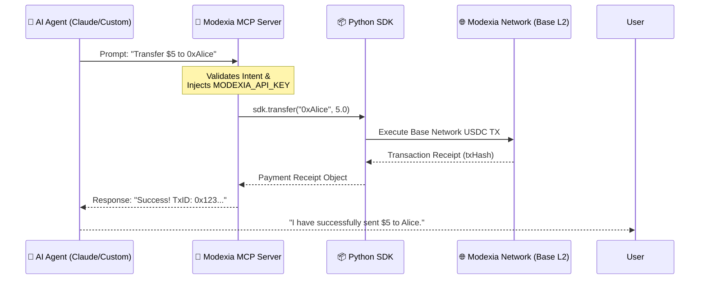
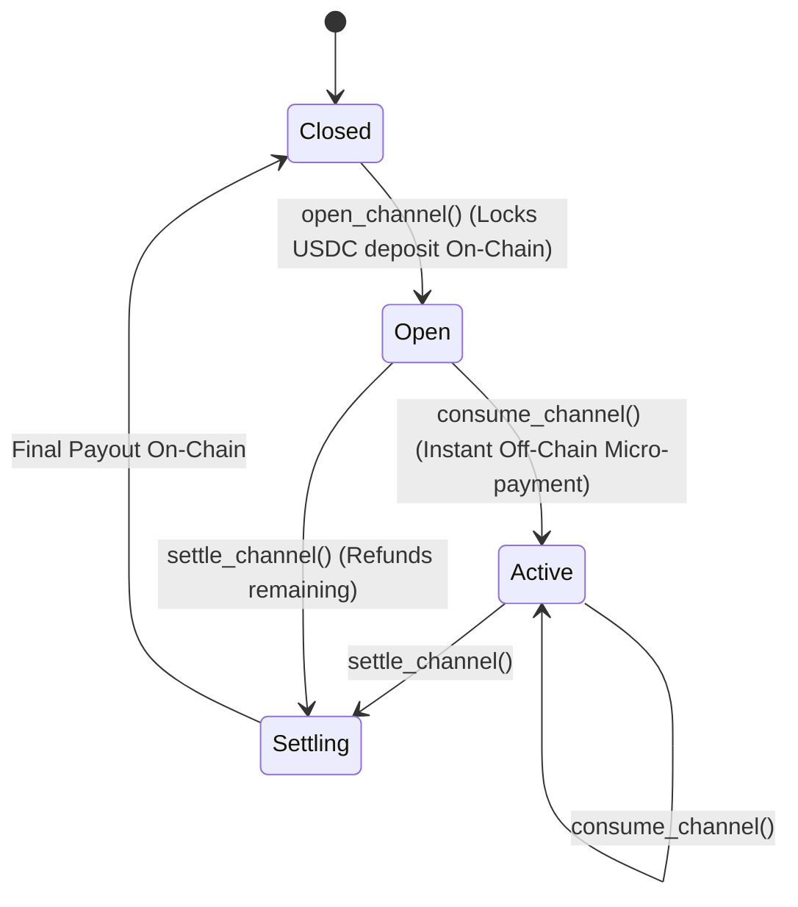

<div align="center">
  <h1>🏦 Modexia AgentPay MCP Server</h1>
  <p><b>The official Model Context Protocol (MCP) server for autonomous AI Agents to interact with Modexia's crypto infrastructure.</b></p>
  
  [](https://badge.fury.io/py/modexia-mcp)
  [](https://pypi.org/project/modexia-mcp/)
  [](https://opensource.org/licenses/MIT)

  <p><b>Latest PyPI release:</b> v0.2.1 — <a href="https://pypi.org/project/modexia-mcp/0.2.1/">project page</a></p>
</div>

<br />

Welcome to the **Modexia MCP Server** (`modexia-mcp`). This server allows your AI agents (like Claude, LangChain bots, or custom swarms) to seamlessly execute secure cryptocurrency transactions (USDC) and zero-fee micro-payments straight from their system prompts.

By connecting this server to an MCP-compatible client, your AI Agent gains a programmatic wallet, enabling it to participate autonomously in the digital economy without requiring complex cryptography inside the LLM context.

---

## 🌟 Getting Started: Your API Key

Before writing your first integration, you will need a Modexia developer account and an API key. 

1. **Visit [modexia.software](https://modexia.software)**
2. Create or log into your developer account.
3. Navigate to your dashboard and generate your **API Key**.

---

## 🏗 System Architecture & Flow

This server acts as a secure, local bridge between your AI agent's reasoning engine and the Modexia blockchain network via the Python SDK.



---

## 📦 Installation & Setup

Because this server is deployed and maintained natively on **PyPI**, you do not need to clone the repository to use it. Your MCP-compatible client will automatically download and execute it in an isolated, secure environment via `uvx`.

### Using Claude Desktop
If you are using Anthropic's Claude Desktop App, simply add this configuration to your `claude_desktop_config.json`:

```json
{
  "mcpServers": {
    "modexia": {
      "command": "uvx",
      "args": ["modexia-mcp"],
      "env": {
        "MODEXIA_API_KEY": "mx_test_YourApiKeyHere"
      }
    }
  }
}
```

> **Note on Environments:** 
> If you do not specify a `MODEXIA_BASE_URL` in the `env` block, the server defaults to the **Sandbox (Testnet)**. To execute real money transactions in production, you must add `"MODEXIA_BASE_URL": "https://api.modexia.software"` and provide an `mx_live_` prefix key.

---

## ✨ Comprehensive Tool Reference

Once connected, your AI Agent natively understands how to use all of the following capabilities. The LLM handles the logic and idempotency; the MCP handles the secure execution.

### Standard Payments & Account Info
- `get_balance()`: Fetches the current USDC balance of the Agent's Smart Contract Wallet. Agents use this as a pre-flight check.
- `transfer(recipient, amount)`: Sends a standard Modexia payment (USDC) to the specified EVM-compatible address.
- `get_history(limit=5)`: Allows the AI agent to introspect its own recent expenditures. Useful for contextual memory.

### High-Frequency Vault Channels
Vault channels allow your agent to execute thousands of micro-transactions per second with **zero gas fees** and **zero latency**.



- `open_channel(provider_address, deposit_amount, duration_hours)`: Locks the requested deposit into a ModexiaVault smart contract. Returns a unique `channelId`.
- `consume_channel(channel_id, amount)`: Executes an instant, cryptographically signed micro-payment inside the open channel. 
- `settle_channel(channel_id)`: Closes the vault, distributes the final payout to the provider, and refunds the unused deposit back to the agent.
- `get_channel(channel_id)`: Checks the remaining balance and expiration.
- `list_channels(provider, status)`: Finds existing open channels to reuse.

### Autonomous API Negotiation
#### `smart_fetch(url, ...)`
This is the hallmark tool of the Modexia MCP. It allows an AI agent to fetch any external URL endpoint and automatically negotiate payments.
1. The tool intercepts the HTTP `402 Payment Required`.
2. Parses the `WWW-Authenticate` header to extract the requested invoice.
3. Silently executes a Modexia payment to fulfill the invoice.
4. Retries the original HTTP GET request with the cryptographic proof-of-payment.
5. Returns the premium data directly to the LLM context.

---

## 🔐 Security Model & Best Practices
The Modexia MCP Server never exposes your private keys to the LLM context. The AI only has permission to trigger explicitly configured MCP tools. Policy limits (like maximum daily spend or hourly limits) can be enforced automatically on the Modexia backend, meaning even a hallucinating AI cannot drain your wallet above your predefined guards.

---

## 📄 License & Support
**modexia-mcp** is an open-source tool governed by the [MIT License](LICENSE).

Need help scaling your agent swarm? Reach out to our engineering team or explore the overarching protocol docs at [modexia.software](https://modexia.software).
