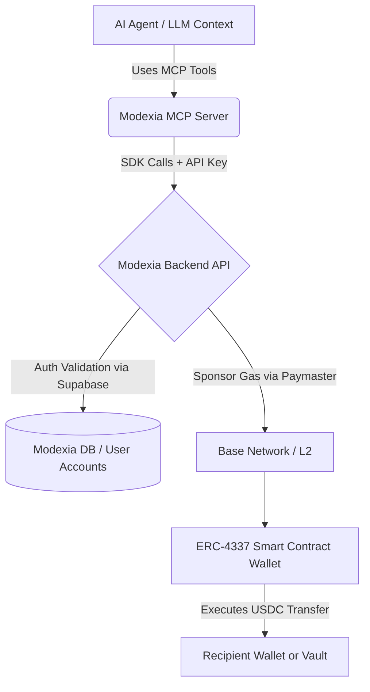
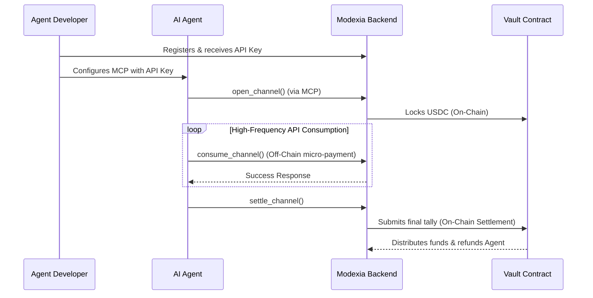
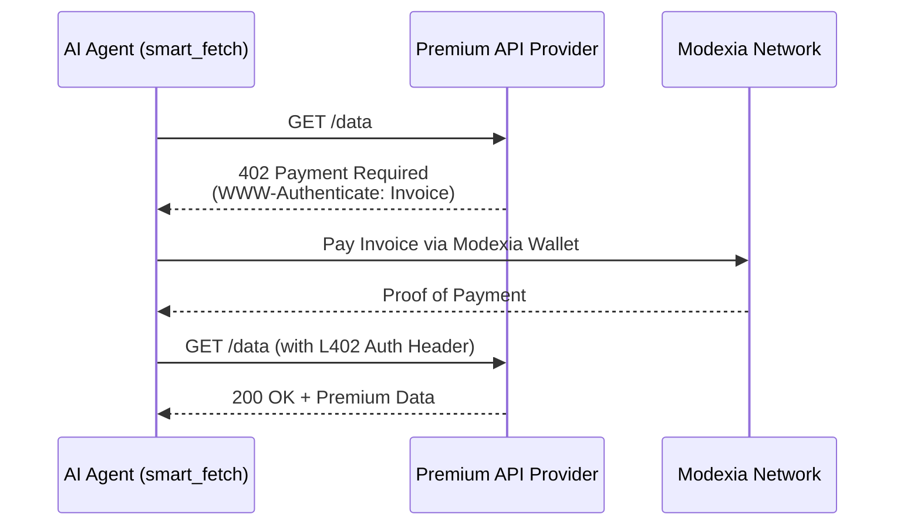

# 📖 Modexia AgentPay: Deep Context & Developer Guide

**modexia-mcp** (PyPI): **v0.2.1** — [release on PyPI](https://pypi.org/project/modexia-mcp/0.2.1/).

## 1. Introduction & Overview
Modexia is a financial infrastructure layer built specifically for **autonomous AI agents**. It bridges the gap between AI development (Python, SDKs, LLM Swarms) and Web3 Smart Contract Accounts (ERC-4337 on the Base Network). 

This powerful protocol allows an AI agent to programmatically control a non-custodial wallet and make fast, cheap payments (USDC) to other agents, services, or human users, all without needing to manage complex cryptographic keys or blockchain infrastructure directly.

## 2. Architecture & Security Model

To understand how Modexia safely bridges AI text generation with blockchain finality, observe the high-level architecture:



### 2.1 Current State: API Key & Managed Wallets
Currently, ModexiaAgentpay prioritizes a seamless developer experience. Agents interact with the protocol primarily through **API Keys**. The Modexia platform acts as a trusted facilitator that abstracts away blockchain complexity (like RPC nodes, gas estimation, and transaction signing) via Circle Developer-Controlled Wallets.

#### The Transaction Lifecycle:


### 2.2 Future State: Trustless State Channels (EIP-712)
As the protocol evolves, Modexia will upgrade to **Fully Trustless State Channels**. In this model, the agent environment manages its own private key and signs "Receipts" (micro-payments) directly off-chain using EIP-712 signatures, which the service provider directly submits to the `ModexiaVault` contract. This removes the Modexia backend as a trusted intermediary for off-chain state tracking.

## 3. SDK Capabilities (Python)
While the MCP server exposes capabilities to the LLM, under the hood it leverages the Modexia Python SDK (`modexiaagentpay`). 

### Initialization
Authentication and environment selection are handled intrinsically via the API Key prefix:
- `mx_test_...` -> Targets Sandbox (Base-Sepolia Testnet)
- `mx_live_...` -> Targets Production (Base Mainnet)

```python
from modexia import create_client

# The client automatically infers the environment from the key prefix
client = create_client(api_key="mx_test_12ab...")
```

### Core Operations in Detail

#### Direct Payment (Transfer Funds)
Sends USDC to a specific wallet address. The platform handles the gas sponsorship implicitly.
```python
receipt = client.transfer(
    recipient="0x7d5...",
    amount=5.00,       # Amount in USDC (Decimal format)
    wait=True,         # Poll for blockchain finality (Recommended)
    idempotency_key="task_123" # Highly Recommended: Prevent double-spend on LLM retries
)
```

#### Smart Fetch (x402 / Paywall Negotiation)
A revolutionary wrapper around HTTP GET. It natively detects `402 Payment Required`.



## 4. Building RAG & AI Agents with Modexia

When building intelligent agents, precise context is critical. 

### RAG Integration
If your agent receives a request to perform a payment but needs to check policies or external constraints first, it should leverage **Retrieval-Augmented Generation (RAG)**. By ingesting this documentation (often exposed via MCP resources), the AI comprehends strict operational rules, such as `transfer` requiring a valid `0x...` hexadecimal string and a purely numerical decimal amount.

### 🛡️ Critical Best Practices for AI Integration
- **Idempotency Keys:** Agents should ALWAYS generate a uniquely predictable string (e.g., `<task_id>_<step_number>`) for the `idempotency_key` when executing payment tools. This prevents accidental double-charging if the AI hallucinates or retries a step.
- **Fail-Safe Error Handling:** AI agents should be aware of `ModexiaPaymentError` (insufficient funds, limit exceeded) and `ModexiaAuthError`. 
- **Gas Fee Awareness:** The AI must understand that it does **NOT** need ETH or Base ETH to transact. Gas fees are fully sponsored by the Modexia Paymaster via Account Abstraction. All operational limits are enforced purely in USDC.
