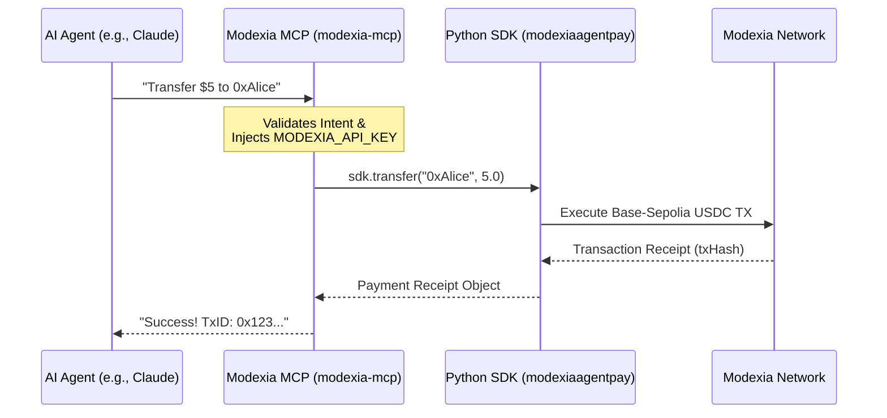

# 🏦 Modexia AgentPay MCP Server

[](https://badge.fury.io/py/modexia-mcp)

Official [Model Context Protocol (MCP)](https://modelcontextprotocol.io) server for **Modexia AgentPay**. This server allows AI agents (like Claude, LangChain bots, or custom swarms) to seamlessly execute secure, instant cryptocurrency transactions (USDC) and micro-payments straight from their system prompts.

## 🚀 How It Works

This server acts as a bridge between your AI agent and the Modexia blockchain network. 



## 🛠️ Installation & Setup

You do not need to clone this repository to use the server. Because it is published to PyPI, your MCP-compatible client will automatically download and execute it using `uvx` inside a secure virtual environment.

### 1. Generate an API Key
You must have an active Modexia Wallet to execute transactions. 
1. Go to your [Modexia AgentPay Dashboard](https://sandbox.modexia.software).
2. Activate your Agent Wallet.
3. Keep your `MODEXIA_API_KEY` (e.g., `mx_test_12345...`) secure.

### 2. Configure Claude Desktop
If you are using Anthropic's Claude Desktop App, simply add this configuration to your `claude_desktop_config.json`:

```json
{
  "mcpServers": {
    "modexia": {
      "command": "uvx",
      "args": ["modexia-mcp"],
      "env": {
        "MODEXIA_API_KEY": "mx_test_YourApiKeyHere"
      }
    }
  }
}
```

> **Note on Environments:** 
> If you do not specify a `MODEXIA_BASE_URL` in the `env` block, the server defaults to the **Sandbox (Testnet)**. To execute real money transactions in production, you must add `"MODEXIA_BASE_URL": "https://api.modexia.software"`.

## 📦 Available Tools

Once connected, your AI Agent natively understands how to use the following capabilities:

- `get_balance`: Retrieve the current USDC wallet balance for the Agent's Smart Contract Wallet.
- `get_history`: Fetch the recent transaction history for the authenticated agent.
- `transfer`: Send a standard Modexia payment (USDC) to a recipient.

#### ⚡ Micro-Payments (Vault Channels)
For high-frequency or streaming payments (e.g., paying per-token for API access):
- `open_channel`: Lock a deposit and open a high-frequency payment vault.
- `consume_channel`: Execute an instant, gas-free micro-payment inside an open channel.
- `settle_channel`: Close the channel, paying the provider and refunding the remainder.
- `get_channel` / `list_channels`: View active financial streaming channels.

#### 🤖 Smart Agent Features
- `smart_fetch`: Fetch an external URL. If the URL throws a `402 Payment Required` paywall, this tool automatically parses the invoice, pays it via the Modexia Network, and retries the request with cryptographic proof-of-payment!

## 🔐 Security & Best Practices
The Modexia MCP Server never exposes your private keys to the LLM context. The AI only has permission to trigger the configured MCP tools. Policy limits (like maximum daily spend or hourly limits) are enforced automatically on the Modexia backend, meaning even a hallucinating AI cannot drain your wallet above your predefined guards.
